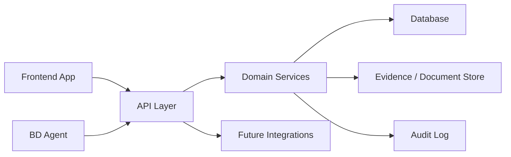
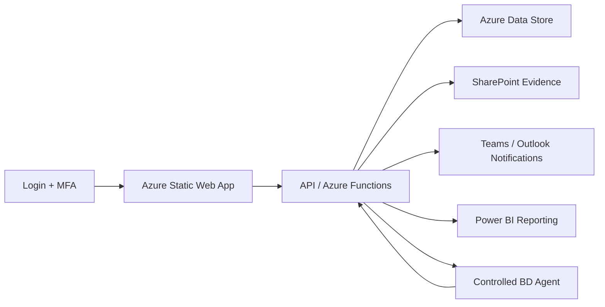

# API- und App-Struktur

## Architekturprinzip

Die App wird API-first gedacht. Das Frontend ist ein Client der API, der Agent ist ein Client der API und spaetere Integrationen wie SharePoint, Power BI, SAP, Dokumentenablagen oder E-Mail-Systeme greifen ebenfalls ueber definierte Schnittstellen an.



## Infrastrukturentscheidungen

### Prototyp

- Kurzfristiges Deployment: stabile Demo-URL auf Vercel.
- Optional kann spaeter eine eigene Domain auf die stabile Vercel-Demo zeigen; die QR-Code-Ziel-URL kann also zunaechst eine Vercel-URL sein und spaeter ueber Domain/Redirect sauber umgestellt werden.
- QR-Code-Ziel: Demo-Login oder direkte Demo-URL mit vorgeschaltetem Login-Screen.
- Demo-Login zeigt rein visuell, dass eine Zwei-Faktor-Authentifizierung abgeschlossen wurde.
- Agentenfunktionen werden im Prototyp kontrolliert gefuehrt und nicht als offene KI-Umgebung bereitgestellt.
- E-Mail-Adressen aus dem Lead-Capture werden gespeichert und als Benachrichtigung an `js090168@fh-muenster.de` gesendet.
- Lead-Capture erscheint nach ca. 30 Sekunden als Modal, damit die Demo nicht unbegrenzt frei nutzbar ist.
- Demo-Nutzer koennen nach dem Lead-Capture Daten eingeben; diese Demo-/Nutzerdaten werden dauerhaft gespeichert, solange Datenschutz und Zustimmung sauber abgedeckt sind.
- Demo-Login kann mit `management@eglv-demo.de` und visuell bestaetigtem MFA-Schritt arbeiten.
- Es wird kein automatisches Einladungsdokument als Produktversprechen genannt.

### Langfristige Zielarchitektur

- Zieldeployment: Azure Static Web Apps, damit die Loesung in eine Microsoft- und Azure-nahe Infrastruktur passt.
- Authentifizierung: Microsoft Entra ID mit Multi-Faktor-Authentifizierung.
- Dokumente und Nachweise: SharePoint oder Microsoft 365 Dokumentenablage.
- Benachrichtigungen und operative Zusammenarbeit: Microsoft Teams und Outlook/Graph.
- Reporting: Power BI.
- Agenten- und Automatisierungslogik: Azure Functions, Azure AI/Azure OpenAI oder kontrollierte Agenten-Workflows.
- Persistenz: Azure SQL, Cosmos DB oder eine andere compliant Azure-Datenhaltung, abhaengig von Projektanforderungen.
- Status fuer die Demo-Kommunikation: Alle Microsoft-Bausteine koennen als vorhandene Infrastrukturannahme dargestellt werden.



## Service-Blueprint

### Kunde und Nutzer

Der Kunde ist die eGLV beziehungsweise ein vergleichbarer Verband, der Ideen, Innovationen und Business-Development-Vorhaben strukturierter bearbeiten will. Nutzergruppen sind Business Development, Fachbereiche, Management, Projektowner und spaeter externe Stakeholder.

### Serviceversprechen

Die Dienstleistungssoftware stellt einen gefuehrten Business-Development-Service bereit:

- Projekte werden systematisch durch Stages und Gates gefuehrt.
- Teams sehen jederzeit fehlende Informationen.
- Managemententscheidungen werden vorbereitet und nachvollziehbar dokumentiert.
- Der Agent reduziert manuelle Arbeit durch strukturierte Vorschlaege.
- Wissen bleibt nicht in Einzelpersonen, sondern wird als Prozesswissen nutzbar.

### Frontstage

Das sieht der Nutzer:

- Dashboard mit Projektstand.
- Projektseite mit Stage-Aufgaben und Nachweisen.
- Gate-Seite mit Entscheidungsgrundlage.
- Agentenpanel mit Vorschlaegen und Zusammenfassungen.
- Einstellungen fuer Stage-Gate-Definitionen.

### Backstage

Das passiert im System:

- Prozessdefinition wird geladen und auf Projektstatus angewendet.
- Vollstaendigkeit von Nachweisen wird berechnet.
- Gate-Kriterien werden aggregiert.
- Agentenkontext wird aus Projekt, Stage, Gate und Evidence gebaut.
- Entscheidungen werden protokolliert.
- Lessons Learned werden in Wissensobjekte ueberfuehrt.

### Support-Prozesse

- Prozessversionierung.
- Rollen- und Rechtemanagement.
- Audit-Logging.
- Demo-Datenmanagement.
- Export von Gate-Briefings und Projektstatus.

## API-Ressourcen

### Process Definitions

```http
GET /api/process-definitions
POST /api/process-definitions
GET /api/process-definitions/{processId}
POST /api/process-definitions/{processId}/versions
POST /api/process-definitions/{processId}/publish
```

Zweck: Stage-Gate-Prozesse definieren, versionieren und freigeben.

### Stages

```http
GET /api/process-definitions/{processId}/stages
POST /api/process-definitions/{processId}/stages
PATCH /api/stage-definitions/{stageId}
DELETE /api/stage-definitions/{stageId}
```

Zweck: Stages bearbeiten, Reihenfolge und Abschlusskriterien verwalten.

### Gates

```http
GET /api/process-definitions/{processId}/gates
POST /api/process-definitions/{processId}/gates
PATCH /api/gate-definitions/{gateId}
DELETE /api/gate-definitions/{gateId}
```

Zweck: Gate-Kriterien, Entscheidungsoptionen und Pflichtnachweise konfigurieren.

### Projects

```http
GET /api/projects
POST /api/projects
GET /api/projects/{projectId}
PATCH /api/projects/{projectId}
GET /api/projects/{projectId}/timeline
```

Zweck: Projekte verwalten und Statusinformationen bereitstellen.

### Project Stages

```http
GET /api/projects/{projectId}/stages
GET /api/projects/{projectId}/stages/{stageId}
PATCH /api/projects/{projectId}/stages/{stageId}
POST /api/projects/{projectId}/stages/{stageId}/complete
```

Zweck: Fortschritt, Aufgaben und Nachweise je Stage steuern.

### Evidence

```http
GET /api/projects/{projectId}/evidence
POST /api/projects/{projectId}/evidence
GET /api/evidence/{evidenceId}
PATCH /api/evidence/{evidenceId}
DELETE /api/evidence/{evidenceId}
```

Zweck: Nachweise, Dokumentlinks, Interviews, Scorings und Business-Case-Artefakte verwalten.

### Business Case Variants

```http
GET /api/projects/{projectId}/business-case-variants
POST /api/projects/{projectId}/business-case-variants
GET /api/business-case-variants/{variantId}
PATCH /api/business-case-variants/{variantId}
```

Zweck: 2-3 Business-Case-Varianten mit einheitlicher Struktur vergleichen.

### Gate Reviews

```http
GET /api/projects/{projectId}/gate-reviews
POST /api/projects/{projectId}/gate-reviews
GET /api/gate-reviews/{reviewId}
PATCH /api/gate-reviews/{reviewId}
POST /api/gate-reviews/{reviewId}/decision
```

Zweck: Gate-Pruefungen vorbereiten, bewerten und Managemententscheidungen dokumentieren.

### Agent Runs

```http
POST /api/agent-runs
GET /api/agent-runs/{agentRunId}
GET /api/projects/{projectId}/agent-runs
POST /api/agent-runs/{agentRunId}/accept
POST /api/agent-runs/{agentRunId}/reject
```

Zweck: Agentenaufgaben starten, Ergebnisse speichern und Nutzerfeedback erfassen.

Beispiele fuer `taskType`:

- `generate_gate_briefing`
- `identify_missing_evidence`
- `draft_business_case`
- `summarize_project_status`
- `extract_lessons_learned`
- `suggest_stakeholder_questions`

### Leads und Demo-Zugang

```http
POST /api/demo-login
POST /api/demo-mfa/verify
POST /api/leads
GET /api/leads
POST /api/leads/{leadId}/notify-owner
```

Zweck: Demo-Login sichtbar machen, Zwei-Faktor-Authentifizierung simulieren oder produktiv anbinden, E-Mail-Adressen dauerhaft speichern und Lead-Benachrichtigung an die Schul-E-Mail-Adresse senden.

### Infrastrukturansicht

```http
GET /api/infrastructure/integrations
GET /api/infrastructure/microsoft-fit
PATCH /api/settings/integrations/{integrationId}
```

Zweck: In den Einstellungen visuell zeigen, wie die App in Microsoft-nahe Infrastruktur eingebunden werden kann.

### Knowledge

```http
GET /api/knowledge-items
POST /api/knowledge-items
GET /api/knowledge-items/{knowledgeItemId}
PATCH /api/knowledge-items/{knowledgeItemId}
```

Zweck: Lessons Learned, Muster und wiederverwendbares Entscheidungswissen speichern.

## Beispielpayloads

### Projekt anlegen

```json
{
  "name": "Pflanzenkohle / Pyrolyse",
  "processDefinitionId": "eglv-bd-v1",
  "entryPath": "technology",
  "owner": "Business Development",
  "strategicField": "Klimaschutz und Kreislaufwirtschaft",
  "summary": "Pruefung einer Pyrolyseanlage zur Reststoffnutzung, CO2-Bindung und moeglichen Produktentwicklung."
}
```

### Agentenlauf starten

```json
{
  "projectId": "project-pyrolysis-demo",
  "taskType": "generate_gate_briefing",
  "stageId": "stage-2-business-case",
  "gateId": "gate-2-invest-rechtsform",
  "outputFormat": "management_briefing"
}
```

### Gate-Entscheidung dokumentieren

```json
{
  "decision": "go",
  "decisionBy": "management",
  "rationale": "Business-Case-Varianten sind ausreichend vergleichbar, Rechtsformpfad ist fuer Pilotierung geklaert, Foerderpotenzial wird weiterverfolgt.",
  "followUpTasks": [
    "Pilotbudget finalisieren",
    "Betreiberstruktur konkretisieren",
    "Reallaborpartner bestaetigen"
  ]
}
```

## Events

Events machen Prozessstatus, Agentenlaeufe und Integrationen robuster.

```text
project.created
project.stage.updated
project.stage.completed
gate.review.created
gate.decision.recorded
evidence.created
agent.run.started
agent.run.completed
process.definition.published
knowledge.item.created
```

## Demo-Deployment

Ziel: Ein Probierlink fuer die eGLV, schnell erreichbar und ohne produktive Sicherheitsannahmen.

Empfehlung:

- Demo-App mit Seed-Daten auf stabiler Vercel-Demo-URL bereitstellen.
- Langfristige Zielarchitektur sichtbar als Azure Static Web Apps beschreiben.
- Demo-Login mit sichtbarer Zwei-Faktor-Authentifizierung zeigen.
- Keine echten vertraulichen Daten.
- Klarer Hinweis: Demonstrator, nicht produktive Plattform.
- Datenreset-Funktion fuer saubere Vorfuehrungen.
- Lead-Capture mit Datenschutz-Hinweis und E-Mail-Benachrichtigung an die Schul-E-Mail-Adresse.
- Modal-Gate nach ca. 30 Sekunden als bewusste Produktzugangsgrenze.
- Persistente Speicherung der Demo-Nutzereingaben nach Zustimmung.
- Kein automatisches Einladungsdokument als Demo-Versprechen.

## Produktionspfad

Nach der Demo sollte der Ausbau in Stufen erfolgen:

1. Authentifizierung und Rollenrechte.
2. Persistente Datenbank und Audit-Logs.
3. Dokumentenablage fuer Evidence.
4. Export von Gate-Briefings als PDF oder PowerPoint.
5. Integration mit bestehenden eGLV-Systemen.
6. Agentenqualitaet ueber Nutzerfeedback und wiederverwendbare Templates verbessern.
7. Migration von Vercel-Prototyp auf Azure Static Web Apps.
